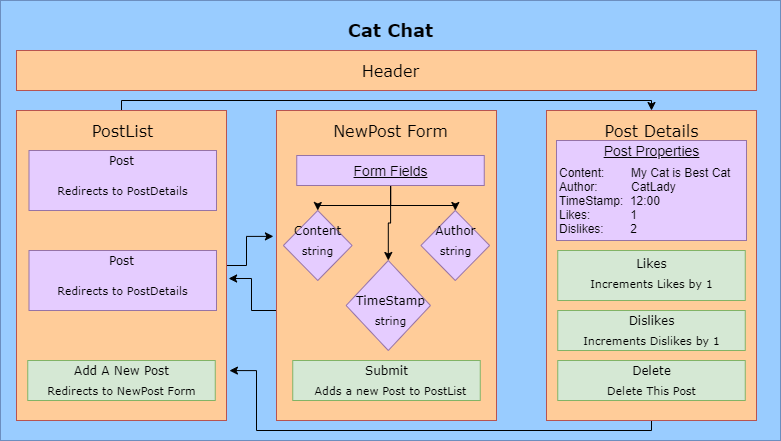

# **Cat Chat**

## Author: **Jozy Kinnaman && Jason Macie**
### July 7th, 2020

### Description

_Cat Chat is the perfect place to sit down, relax, and share pictures of your cat._



### Instructions for use:

1. Open Terminal (macOS) or PowerShell (Windows)
2. To download the project Directory to your desktop enter the following commands:
```
cd Desktop
git clone...
cd 
```
3. To view the downloaded files, open them in a text editor or IDE of your choice.
* if you have VSCode for example, when your terminal is within the main project Directory you can open all of the files with the command:
```
code .
```
5. Download node and node package manager if they are not already installed on your device. You can find further instructions [here](https://www.learnhowtoprogram.com/intermediate-javascript/getting-started-with-javascript-8d3b52cf-3755-481d-80c5-46f1d3a8ffeb/installing-node-js-14f2721a-61e0-44b3-af1f-73f17348c8f4).
5. Run npm install in your terminal to download the necessary dependencies, plugins, and modules.
```
npm install
```
6. The command npm run start will build and open the compiled code in a browser of your choice using a local host.
```
npm run start
```

### Known Bugs

_Site is unable to store data._

### Support and Contact Information

_Please contact jozypants@gmail.com or macjay314@gmail.com with questions._ 

### Technologies Used

* React
* JavaScript
* JSX
* HTML
* Git and GitHub

### Specs
| Spec | Input | Output |
| :------------- | :------------- | :------------- |
| **As a user, I want to enter content into a form and submit to create a new post.** | User Input: "Today my cat meow'd" | Output: "Post created." |
| **As a user, I want my new posts to include a timestamp. And I want to see when other listings were posted, too.** | User Input: "Today my cat meow'd" | Output: "Post created 7/7/2020 2200." |
| **As a user, I want to upvote posts I particularly enjoy.** | User Input: "User clicks + button" | Output: Likes: 2, Dislikes: 0 |
| **As a user, I want to downvote posts I don't like, or find inappropriate.** | User Input: "User clicks + button" | Output: Likes: 2, Dislikes: 1  |
| **As a user, I'd like posts with the most upvotes to appear higher on the page.** | User Input: localhost:3000 | Output: Top Posts |

#### License

This software is licensed under the MIT license.

Copyright © 2020 **_Jason Macie && Jozy Kinnaman_**
